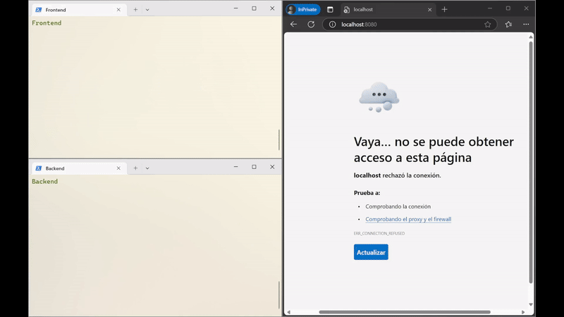

<!-- template for a README for GitHub -->
# Link shortener: backend
This project gives a REST API for the project [link-shortener-frontend](https://github.com/ckdvk/link_shortener-frontend) and it is made with Node.js and Express.js. It provides several endpoints to perform the CRUD operations required for the frontend.

## Setup
1. Clone the repository
```bash
 git clone https://github.com/ckdvk/link_shortener-backend.git
 ```
2. Go to the project directory
```bash
cd link_shortener-backend/link_shortener
```
3. Install the dependencies
```bash
npm install
```
4. Start the server
```bash
node index.js
```

## How it works

When the project starts, the HTTP server is created and listens on the port PORT described in the .env file. Once the server is running, it creates a new SQLite database in `DATABASE_PATH` if it does not exist. The server waits until this database is created and then it creates a table named users with the following schema:

```sql
users:
	id
	username
	password
```
and a table named links with the following schema:

```sql
links:
	id
	original_url
	short_url
	user_id
```

These are the tables that the server uses to store the data relative to users and links to shorten.

The server then listens for incoming requests and responds to them according to the endpoints described below.

## Endpoints

The server provides the following endpoints:

### POST /api/userRoutes/login
This endpoint receives a JSON object with the following structure:
```json
{
	"username": "username",
	"password": "password"
}
```
It checks that the user and password provided belong to the database and, if so, it returns a JSON object with the following structure:
```json
{
	"token": "JWT_STRING_HERE"
}
```
where token is a JWT token that the frontend uses to authenticate the user. It is the first step in the authentication process for the user.

Since this is a toy project, the password is stored in plain text in the database. In a real-world project, the password would be hashed before storing it in the database. Also, there is only one user in the database, with name `DEFAULT_DB_USER` and password `DEFAULT_DB_PASSWORD`, given in the .env file.

### POST /api/tokenRoutes/verify-token

This endpoint receives from the header (`Authorization: Bearer <token>`) a JSON object with the following structure:
```json
{
	"token": "token"
}
```

It checks that the token provided is valid and, if so, it returns a JSON object with the following structure:
```json
{
	"valid": true,
	"user": decoded
}
```
where `decoded` is the decoded token. This endpoint is used by the frontend to check if the token is still valid. If it is, then no new login is required.

### POST /shortenUrl

This endpoint receives a JSON object with the following structure:
```json
{
	"original_url": "original_url"
}
```
Also, it receives a token in the header. It checks that the token is valid and, if so, it returns a JSON object with the following structure:
```json
{
	"short_url": "short_url"
}
```
where `short_url` is the shortened URL. If the token is not valid or the corresponding user is not in the database, it returns an error code. The shortened URL `short_url` is generated by the server by generating a random string of 5 alphanumeric characters (this can be adjusted and, of course, it is possible to get an already existing string). The server checks that this string is not already in the database. If it is, it generates a new one until it finds one that is not in the database. The server then stores the original URL, the shortened URL, and the user ID in the database and then sends the shortened URL to the frontend.

### GET /:shortUrl

When a request is made to this endpoint with a shortened URL, the server checks if the URL `shortURL` is in the database. If it is, it redirects the user to the original URL. If it is not, it returns an error code.

## Database: SQLite

The backend uses SQLite as a lightweight database to store users and shortened links. The database is initialized automatically when the server starts.

### Configuration

The database file location is specified in the `.env` file using the variable:

```ini
DATABASE_PATH=./db/shortener.db
```

The default user credentials are also set in `.env`:

```ini
DEFAULT_DB_USER=user
DEFAULT_DB_PASSWORD=password
```

### Database Initialization

When the backend starts, the following steps are performed:

1. **Connecting to SQLite**  
   The backend loads the database from `DATABASE_PATH`. If the file does not exist, it is automatically created.

2. **Creating Tables**  
   If the tables do not already exist, the backend creates:
   - A `users` table to store usernames and passwords.
   - A `links` table to store original and shortened URLs, linked to a user.

   ```sql
   CREATE TABLE IF NOT EXISTS users (
       id INTEGER PRIMARY KEY AUTOINCREMENT,
       username TEXT NOT NULL,
       password TEXT NOT NULL
   );

   CREATE TABLE IF NOT EXISTS links (
       id INTEGER PRIMARY KEY AUTOINCREMENT,
       original_url TEXT NOT NULL,
       short_url TEXT NOT NULL,
       user_id INTEGER NOT NULL,
       FOREIGN KEY (user_id) REFERENCES users(id)
   );
   ```

3. **Creating a Default User**  
   If a default user (specified in `.env`) does not exist, it is created automatically.

### How Data is Stored

- When a user logs in, their credentials are checked against the `users` table.
- When a link is shortened, a new entry is added to the `links` table, including the original URL, the shortened version, and the user ID.


All these steps are done in such a way each step awaits the previous one to finish. This ensures that the database is ready before trying to access it.


## Summary

After setting up the server following the instructions in [Setup](#setup), the server listens for incoming requests and responds to them according to the endpoints described in [Endpoints](#endpoints). The server provides a REST API for the frontend to perform the CRUD operations required for the application to work.

## Demo
<!-- demo in demo.gif -->
A short demo of the whole application, with both frontend and backend:

